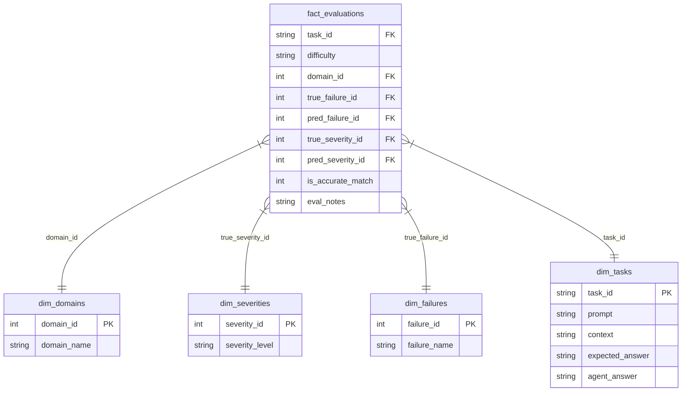

# ◆ LLM Agent Failure Analysis & Observability

An advanced, asynchronous evaluation and observability platform for analyzing, classifying, and reporting AI agent failures. Using a structured LLM judge (Google Gemini), it parses agent response logs, categorizes the root causes of failures, stores them in a normalized SQLite star schema, and visualizes the results on a premium "Zinc-themed" interactive dashboard.

---

## 🚀 Key Features

* **Asynchronous LLM Judging**: Parallel log evaluation using LangChain's async `ainvoke` with configurable concurrency and rate-limit delay protections for free-tier quotas.
* **Structured Output Classification**: Uses Pydantic schema validation to ensure the LLM outputs strict failure categories (e.g., *Hallucination*, *Reasoning Failure*, *Planning Failure*) and severities.
* **SQL/BI Star Schema ETL**: Automatically transforms flat CSV evaluations into a normalized SQLite database (`ai_observability.db`) with 4 dimension tables and a central fact table—fully optimized for Power BI, Tableau, or SQL querying.
* **Zinc-Themed Observability Dashboard**: A premium Streamlit dashboard with:
  * Dynamic **Light/Dark Mode** visual toggles.
  * SaaS-grade custom HTML/CSS KPI metric cards.
  * Interactive Plotly charts (Failure Mode distributions, Severity risk breakdown, and Domain performance).
  * Searchable **Audit Log table** and an interactive **Detailed Task Inspector**.
  * Live **Database Explorer** to browse raw tables.

---

## 🗄️ Database Architecture (Star Schema)

The ETL pipeline normalizes the evaluation outputs into a relational database model:



---

## 🛠️ Setup & Installation

### 1. Prerequisites & Dependencies
Clone this repository and install the required Python libraries:
```bash
pip install -r requirements.txt
```
*(Dependencies: `streamlit`, `plotly`, `pandas`, `numpy`, `langchain`, `langchain-google-genai`, `scikit-learn`, `tqdm`, `python-dotenv`)*

### 2. Configure Environment Variables
Create a `.env` file in the root directory and add your Gemini API Key:
```env
GEMINI_API_KEY=your_gemini_api_key_here
```
*(Note: `.env` is listed in `.gitignore` and is kept secure from being pushed to public GitHub repos).*

### 3. Run the Evaluation Pipeline
Execute the async pipeline to classify the benchmark logs, compute performance metrics (Accuracy, Macro-F1), and load the SQLite database:
```bash
python evaluate_benchmark.py
```

### 4. Launch the Dashboard
Run the Streamlit web application locally:
```bash
streamlit run dashboard.py
```
Open **[http://127.0.0.1:8501](http://127.0.0.1:8501)** in your browser to interact with the dashboard.

---

## 🔗 Share on LinkedIn & Streamlit Community Cloud

### Step 1: Push to GitHub
1. Create a new public repository on GitHub.
2. Initialize your local git, commit all files (ensuring `.env` is ignored), and push:
   ```bash
   git init
   git add .
   git commit -m "Initial commit of AI Risk & Compliance Observability App"
   git branch -M main
   git remote add origin https://github.com/Shudufhadzo882/llm-agent-failure-observability.git
   git push -u origin main
   ```

### Step 2: Deploy Free on Streamlit Cloud
1. Go to [share.streamlit.io](https://share.streamlit.io/) and log in with your GitHub account.
2. Click **Create app**, select your repository, branch (`main`), and set the main file path to `dashboard.py`.
3. If using any secret API keys inside the deployed app, enter them in the app settings' **Secrets** section.
4. Click **Deploy!** Once compiled, Streamlit will give you a public, live shareable URL: **https://llm-agent-failure-observability-h4dpsxvihdmupx547redso.streamlit.app/**.

### Step 3: Share on LinkedIn
Copy your live Streamlit URL and share it with your professional network:
> 🚀 **Excited to share my latest project: AI Risk & Compliance Observability Dashboard!** 
> 
> I built an asynchronous LLM-judging pipeline using LangChain & Gemini to evaluate AI agent failures. It parses log files, classifies root causes (Hallucinations, Planning Failures, etc.), processes them through an ETL pipeline into a SQLite Star Schema, and serves an interactive dashboard.
> 
> 🔗 Live App: https://llm-agent-failure-observability-h4dpsxvihdmupx547redso.streamlit.app/
> 📁 GitHub Code: https://github.com/Shudufhadzo882/llm-agent-failure-observability
> 
> #AI #LLM #Observability #Streamlit #GenAI #Mangement #RiskCompliance
